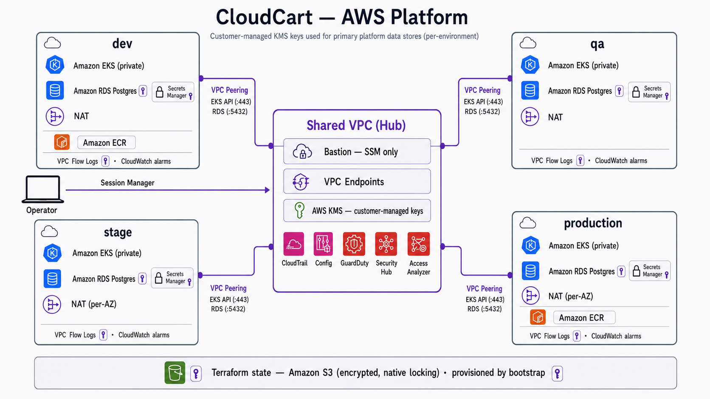

# CloudCart — AWS Terraform (Multiple Environments)

Terraform configuration that provisions CloudCart's AWS infrastructure across
`dev`, `qa`, `stage`, and `production` from a shared set of modules (VPC, EKS,
RDS Postgres, ECR, bastion, security groups, IAM). All provisioned resources
are named with the `cloudcart` prefix.

A hub-and-spoke topology: a shared hub VPC runs a private SSM-only bastion, the
VPC endpoints, and the account-level security services (CloudTrail, Config,
GuardDuty, Security Hub, Access Analyzer), peered into each environment. Primary
data stores are encrypted with per-environment customer-managed KMS keys. See
[docs/architecture.md](docs/architecture.md) for the detailed diagrams and apply
order.

## State backend

Each environment stores state in its own S3 bucket
(`cloudcart-<env>-terraform-state`) with **S3-native locking**
(`use_lockfile = true`, requires Terraform >= 1.10) — no DynamoDB.

Those buckets are created by the **`bootstrap/`** config (local backend), which
must be applied once before anything else. See `bootstrap/README.md`.

## CI/CD

GitHub Actions workflows:

- **`terraform-ci.yml`** — on Terraform changes: `fmt`, `validate` (all envs,
  offline), and `plan` for the spoke envs (dev/qa/stage/production) via AWS
  OIDC. `shared` is validated but not planned in CI (it depends on the other
  envs' remote state).
- **`checkov.yml`** — static security/compliance analysis, SARIF uploaded to
  GitHub code scanning (`soft_fail`, offline).
- **`tflint.yml`** — provider-aware linting (`.tflint.hcl`, recursive, offline).
- **`trivy.yml`** — Trivy config/misconfig scan, SARIF → code scanning (offline).
- **`infracost.yml`** — cost estimate per env (defined in
  `.github/infracost.yml`), parsed from HCL (no AWS needed), posted as a single
  PR comment.
- **`terraform-docs.yml`** — regenerates each module's `README.md`
  (inputs/outputs tables) and commits the update back to the PR branch.
- **`packer-bastion.yml`** — validates and builds the bastion AMI (see
  `packer/README.md`).
- **`terraform-apply.yml`** — manual, environment-gated `apply` per config
  (GitHub Environments provide the approval gate).
- **`terraform-drift.yml`** — nightly `plan` per spoke; fails on drift.

### Required repo configuration (Settings → Secrets and variables → Actions)

**Variables**

| Name | Used by | Purpose |
|---|---|---|
| `AWS_TF_ROLE_ARN` | terraform-ci | OIDC role for `terraform plan` (read access + state backend) |
| `AWS_PACKER_ROLE_ARN` | packer | OIDC role to build AMIs |
| `AWS_REGION` | both | region (optional, default `us-west-2`) |
| `PACKER_SUBNET_ID` | packer | build subnet with egress (optional) |

**Secrets**

| Name | Used by | Purpose |
|---|---|---|
| `INFRACOST_API_KEY` | infracost | Infracost cost estimates/comments |

Both workflows authenticate with **GitHub OIDC** — no long-lived AWS keys.
`plan`/`infracost` never run for fork PRs.

### Local developer tooling

- **`Makefile`** — `make help` lists targets (`fmt`, `validate-all`, `plan`,
  `docs`, `lint`, `security`, `bootstrap`, …).
- **`scripts/`** — `validate-all.sh` (offline, every config) and `plan-all.sh`
  (spokes, needs AWS).
- **`.pre-commit-config.yaml`** — fmt / validate / terraform-docs / tflint on
  commit (`pre-commit install`).
- **`.github/CODEOWNERS`** — review ownership for `modules/`, `production/`, etc.

## Documentation

- [docs/architecture.md](docs/architecture.md) — topology, dependency graph, apply order
- [docs/adr/](docs/adr/) — architecture decision records
- [CONTRIBUTING.md](CONTRIBUTING.md) · [SECURITY.md](SECURITY.md)
