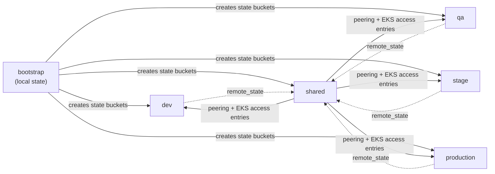
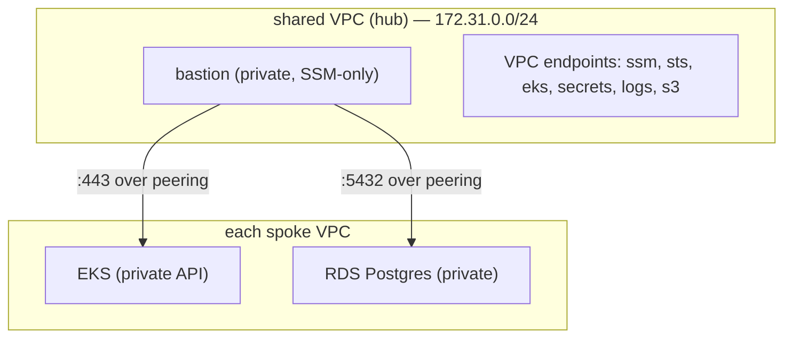

# Architecture


CloudCart runs a **hub-and-spoke** AWS platform. Each environment is an isolated
VPC (a "spoke"); a dedicated **shared** VPC (the "hub") runs a single private,
SSM-only bastion and the account-level security services, peered into every
spoke.

## Repository layout

```
bootstrap/         # state buckets (local backend, run first)
environments/      # root configs: dev, qa, stage, production, shared
modules/
  networking/      # vpc, sg, peering
  compute/         # eks, bastion
  database/        # postgres
  security/        # kms, secrets, role, guardduty, cloudtrail, config, securityhub, access-analyzer
  storage/         # ecr, tf-backend
  observability/   # monitoring
examples/  scripts/  docs/  packer/  .github/
```

## Environments

| Config | VPC CIDR | Role |
|---|---|---|
| `bootstrap` | — | Creates the S3 state buckets (local backend) |
| `dev` | `172.32.0.0/16` | Spoke: VPC, EKS, RDS, ECR |
| `qa` | `172.33.0.0/16` | Spoke |
| `stage` | `172.34.0.0/16` | Spoke (per-AZ NAT) |
| `production` | `172.35.0.0/16` | Spoke (per-AZ NAT) |
| `shared` | `172.31.0.0/24` | Hub: bastion, peering, CloudTrail/Config/GuardDuty/SecurityHub/Access Analyzer |

## State & apply dependency graph

Spokes never read the hub's state (they take a static `bastion_cidr`); only the
hub reads the spokes' remote state. Dependencies are one-directional.



**Apply order:** `bootstrap` → the four spokes in `environments/` → `environments/shared`.

## Network topology



## Access

- **Bastion access:** SSM Session Manager only — no public IP, no inbound ports,
  no key pair. Reached via `aws ssm start-session --target <id>`.
- **EKS:** private endpoint, reachable from the peered hub; the bastion role has
  a per-cluster EKS access entry.
- **RDS:** private, reachable from the hub over peering; the DB password lives in
  Secrets Manager (`cloudcart-<env>-db-password`).

## Security & observability

Account-level services live in `shared`: CloudTrail (multi-region, CMK-encrypted),
AWS Config, GuardDuty, Security Hub, IAM Access Analyzer. Every VPC ships VPC Flow
Logs. See [ADRs](./adr/) for the key decisions.
